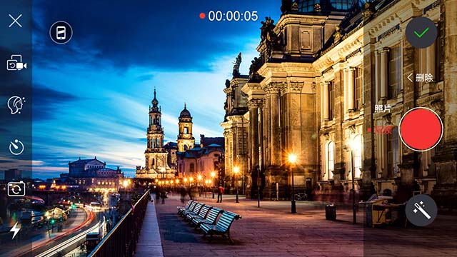
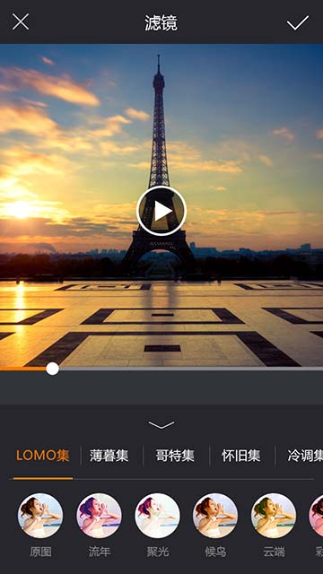
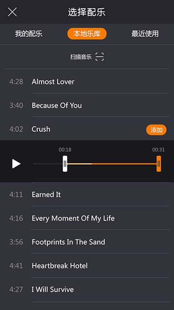
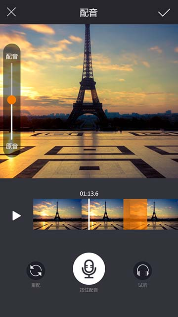
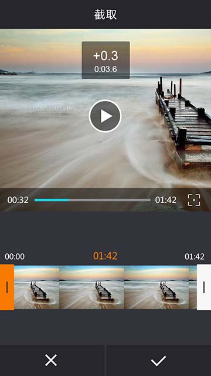
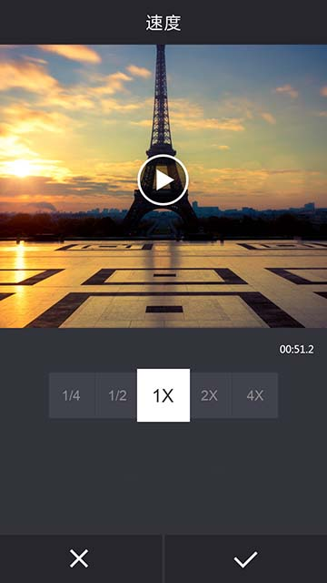
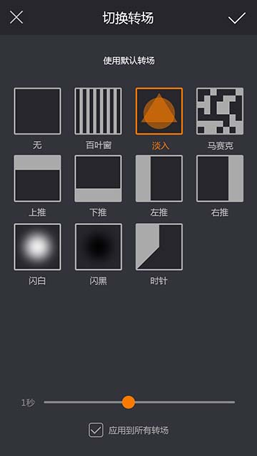

# 锐动视频编辑SDK android版
&emsp;&emsp;集视频拍摄和视频剪辑功能于一体,同时包含视频配音配乐、字幕特效、滤镜、转场等各种功能，全方位满足开发者的需求，并可以快速植入到APP中。`编辑预览时支持智能硬件解码，选择视频时不需要转码，减少用户等待时间`。

###SDK功能介绍:
####1.拍摄
* **实时美颜**	
* **多段拍摄**
	一个视频可以分多段次拍摄,并支持回删
* **多种拍摄模式**
	支持长按拍摄、快速点击持续拍摄
* **定时拍**
	支持5秒内定时拍摄
* **摄像头切换**
	前、后摄像头自由切换，中间无卡顿
* **多比例支持**
	支持1:1 、9:16、16:9多个比例录制
* **变焦、对焦**
	通过相应手势可以缩放摄像头采集画面及清晰度(依赖硬件支持)
* **滤镜**
	内置主流滤镜，与编辑滤镜同步，支持扩展更多滤镜
* **照片**
	当前摄像头画面保存到图片
	
####&emsp;截图
  

####2.视频编辑
* **滤镜**
	内置主流滤镜，支持扩展更多滤镜
* **字幕、特效**
	字幕特效在指定位置，指定时间段显示；
	字幕支持设置字体大小和颜色及背景图；
	实时预览效果
* **配音、配乐**
	支持指定时间段添加配音；
	支持配音、配乐与视频原音比例调节；
	支持本地添加更多配乐
* **截取、分割**
	支持毫秒级截取、分割视频；
	支持快速预览截取、分割后视频
* **调速**
	调整视频的播放速度，快放或者慢放
* **转场**
	支持多种转场；
	支持随机转场、指定转场时长等扩展设置
* **其它编辑功能**
	支持多种比例裁剪；
	支持90、180、270度旋转视频画面；
	支持左右镜像、上下镜像；
	支持输出比例调整；
	支持横屏编辑；
	支持文字版；
	支持图片时长设置；
	支持视频调序等
	
####&emsp;截图
   

   

###最新SDK下载(以下链接是最新的，github代码会稍有延迟)：

[SDK下载请单击](http://d.56show.com/rdsdk/private/pack/rd_videoedit_android_20170321.zip)

###功能试用：

您可以在安卓市场搜索“秀拍客”，我们使用本SDK整合的app。目前很多国内外软件企业已经整合到他们的产品中，我们这里不方便进行罗列。

###关于授权：

www.rdsdk.com 致力于专业的人做专业的事，降低客户的开发时间和开发成本，你只需要支付很少的费用，花上几个小时就能增加视频编辑功能。

[单击申请试用](http://www.rdsdk.com/home/business/registers)

**开发文档:**

[点击查看](https://rdsdk.github.io/rdVideoEditSDK-for-Android/Android%E9%94%90%E5%8A%A8%E8%A7%86%E9%A2%91%E7%BC%96%E8%BE%91SDK%E6%96%87%E6%A1%A3.pdf)

**JAVA接口文档:**

[点击查看](https://rdsdk.github.io/rdVideoEditSDK-for-Android/xpkUISdk/docs/xpkUISdk/index.html)

###洽谈咨询：

**SDK交流群：** [305128688](http://shang.qq.com/wpa/qunwpa?idkey=bb9ac035ffa2d930719535a3b5d4542a780bb0f94613385fd93c996ee816ef05)

**咨询电话: 4008989105**

**客服电话: 15313066905 (周一至周五 9:00-18:00)**

**客服邮箱：<2637433751@qq.com>**

